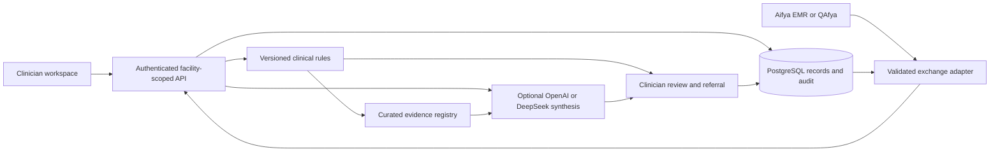

# NCDAI 2.0 product and engineering blueprint

Version 0.1 · 12 September 2026 · Research software, pending independent clinical approval

NCDAI 2.0 supports frontline clinicians caring for adults with noncommunicable diseases. Its intended benefit is a more complete, less repetitive consultation: identify relevant risk, reconcile missing information, display evidence-linked actions, record the clinician's decisions, and support referral and follow-up. Benefit is an evaluation hypothesis, not an established result.

The user requested a complete application, specifications, robust database and tests, with at least 50 full synthetic case uses before drafting the validation/pilot protocol and grant concept. Those later research deliverables are intentionally outside this implementation phase. The existing NCDAI study provides formative evidence, not validation of this new version. No previous source code, patient data, private grant feedback or licensed guideline PDFs are copied into this repository.

## Product scope and clinical coverage

| Domain | First release capability | Boundary |
| --- | --- | --- |
| Cardiovascular disease | BP measurement review, severe readings and acute warning symptoms, medication safety, risk-factor review and referral | No autonomous diagnosis, cardiovascular risk score without a validated calculator, or treatment titration |
| Diabetes | Glucose units, hypoglycaemia/hyperglycaemia warning patterns, HbA1c follow-up, medication/renal checks and foot warning signs | No autonomous insulin calculation or regimen initiation |
| Chronic respiratory disease | Asthma/COPD history, oxygenation/respiratory observations, acute symptoms, inhaler-review prompts and referral | No spirometry-based diagnosis without results; no autonomous emergency treatment |
| Kidney disease | eGFR/potassium findings, chronicity review, medication risks and referral | A single low eGFR is not automatically diagnosed as chronic kidney disease |
| Cancer | Warning symptoms and known-cancer coordination/referral prompts | No cancer diagnosis, staging, chemotherapy or unsupported screening eligibility |
| Multimorbidity | Combined encounter, medicines, allergies, shared safety checks and prioritized actions | The engine is not a complete drug-interaction database |

Children and specialist maternal care are outside the adult clinical pathway. A pregnancy flag triggers appropriate safety/escalation and scope limitations; it does not activate routine adult prescribing. Undifferentiated dangerous symptoms require assessment regardless of whether their eventual cause is an NCD.

## Users and real consultation workflow

Clinicians create and assess encounters and record final decisions. Supervisors review audit trails and care-workflow metrics, with clinical permissions explicitly assigned. Administrators manage accounts/configuration and do not acquire clinical authority merely from their technical role. Every user belongs to an authorized facility; cross-facility access is denied by the server.

The consultation is: authenticate → select the correct patient → review previous encounters → capture only missing/current observations and mark what was assessed → generate support → inspect urgent findings, unknowns and sources → accept, modify, defer or reject each recommendation → save a reviewed encounter → arrange referral where appropriate → record referral outcome. The interface shows patient identity throughout, clear units, draft/reviewed state and validation errors beside inputs. A clinician decision is never recorded by a model.

Editing an unreviewed encounter invalidates its previous assessment. A stale browser cannot finalize an old version. Reviewed records are immutable in this release; amendments require a new encounter and documented linkage rather than silent replacement. The deployment blueprint requires formal amendment and retention policies before use with real records.

## Fifteen specialist workstreams

These are AI-assisted engineering/review workstreams, not claims of licensed clinician review or independent human certification. A maximum of three run concurrently while the lead integrates their work.

1. Clinical decision logic and medication safety.
2. Backend architecture and transactional application behavior.
3. Clinician interface and workflow design.
4. Database architecture, migrations and recovery.
5. Security, privacy and authorization.
6. Interoperability, terminology and EMR contracts.
7. AI assurance, evidence grounding and provider adapters.
8. Independent synthetic clinical workflow tests.
9. Accessibility and human factors.
10. Reliability, monitoring and operations.
11. Kenyan health-system deployment and governance.
12. Clinical evidence versioning and guideline provenance.
13. Performance, concurrency and scalability.
14. Reproducibility, supply-chain hygiene and release engineering.
15. Independent adversarial review and acceptance evidence.

Each review should produce findings or evidence with a clear owner and disposition. Disagreement is resolved against observable behavior and primary sources; a favorable agent review does not substitute for a clinical safety officer or independent evaluator.

## Architecture

The backend is a modular FastAPI application with SQLAlchemy and explicit migrations. PostgreSQL is the production database; SQLite is confined to a local synthetic demonstration/test configuration. The React/TypeScript client cannot enforce security by itself: ownership, permissions, data validation, workflow transitions and audit writes are server responsibilities.

A modular monolith keeps clinical transactions coherent and lowers deployment complexity. External AI and vendor integrations sit behind bounded adapters. Splitting services is justified only by demonstrated operational or scaling needs. Clinical rules remain available when a remote AI provider is unavailable.

## Data model and invariants

Core records are Facility, User, Session, Patient, Encounter, Assessment/Review snapshot, Referral and AuditEvent. All identifiers are opaque UUIDs. The facility is derived from the session, not accepted as authority from an input payload. Patient external IDs are unique within their source/facility context. Names are not identity keys.

Clinical values retain units, observation times and source provenance where available. Unknown, absent, present and not-assessed states are distinct. Glucose is normalized explicitly; input and exported units remain inspectable. Systolic and diastolic values have distinct fields. DOB and encounter date determine age. NaN, infinity, invalid dates, unsupported enum values and impossible measurements are rejected.

Mutations and their audit events commit atomically. Encounter versions provide optimistic concurrency checks. Clinical review is tied to the precise current assessment and requires a decision on every recommendation. Non-acceptance requires an explanation; modifications require replacement text. Audit logging excludes passwords, tokens and unrestricted clinical notes; integrity verification supports detection of tampering but does not imply that database administrators cannot tamper. Production access separation and protected audit copies are additional controls.

Database requirements include foreign keys, unique constraints, appropriate facility/time indexes, UTC timestamps, transaction rollback, schema migration tests, backup/restore drills and retention policy enforcement. Production backup objectives are proposed RPO ≤24 hours and RTO ≤4 hours, to be confirmed against hosting and county requirements; they are targets until drills establish them.

## Clinical and AI safety

All clinical rules have stable identifiers, source references, version metadata and tests. Proposed thresholds are implementation choices requiring clinician signoff. The engine is conservative about acute danger and explicit about missing information. It must never assert that a normal measurement rules out all serious disease.

OpenAI and DeepSeek adapters use explicit configured model names and timeouts. Provider names are configuration, not authorization to transmit identifiable patient data. Inputs are minimized; names, contacts and external identifiers are excluded from model requests. Retrieved evidence must actually appear in the model input. Sources are controlled registry entries, never fabricated citation strings. Structured output is validated and unknown references are rejected.

The model may synthesize supplied facts and supported explanations. It cannot lower deterministic urgency, remove safety findings, finalize encounters, write orders or autonomously prescribe. Refusal, malformed output, timeout, unsupported references and unavailable credentials produce a visible bounded fallback. User-entered notes and retrieved material are data, not instructions for the system. Any generative summary remains clinician-reviewable and is not treated as a validated diagnosis.

Every saved assessment records the rules/evidence version, provider/model mode, time and input snapshot. Model changes, guideline changes and prompt changes require regression checks and a documented release. No online self-training from clinician agreement clicks is permitted.

## Interoperability

The initial adapter boundary targets Aifya EMR and QAfya. Their authenticated vendor APIs, resource identities, patient matching rules, permissions, update semantics and sandbox credentials must be supplied before live integration can be verified. No vendor endpoint is invented or treated as tested.

FHIR R4 export uses Patient, Encounter, Observation and a reviewed care summary as appropriate, with coded observations and units. A round-trip adapter must preserve identity, reference integrity, unit meaning, observation time and provenance; imports must be validated before clinicians confirm them. Idempotency and conflict handling prevent duplicate writes. SMART App Launch and CDS Hooks are suitable where supported, not assumed vendor features.

Kenya Core profiles, applicable HIE onboarding, terminology and DHA certification requirements must be confirmed for the deployment. Base FHIR validation does not equal Kenya-profile conformance or certification. Reporting to HMIS/DHIS2 is a separate mapping from encounter-level clinical exchange.

## Security and privacy

Security requirements include protected password hashes, opaque revocable sessions, HttpOnly cookies, CSRF validation, origin controls, rate limits, bounded input sizes, facility isolation, least privilege, audited exports, redacted logs and no secrets in source control. Production refuses demo seeding and unsafe cookie/secret/database settings. TLS termination, encrypted disks/backups, secret rotation and production monitoring must be evidenced at deployment.

The institutional data controller, processors, authorized uses, retention schedules, data-subject processes, cross-border AI transfers and incident responsibilities require written decisions. A DPIA and relevant institutional/ethics approvals cover the actual deployment and version. This repository makes no unsupported claim of ODPC registration, DHA certification, regulatory authorization or international standards certification.

## Quality requirements and acceptance

Functional acceptance requires at least 50 distinct complete synthetic case workflows across the supported NCD domains, plus boundary, negative and adversarial tests. A complete workflow creates a patient, captures an encounter, generates and inspects support, records all review decisions, retrieves the immutable record, exercises referral when indicated and validates an authorized export. Persisted data, evidence and audit events must agree.

Safety tests cover acute red flags at normal and abnormal measurements, unit equivalence, missing data, interacting medications, pregnancy, renal impairment, contradictory inputs and unsupported scope. Security tests cover anonymous access, cross-facility reads/writes, CSRF, role restrictions, session revocation, malformed payloads and stale versions. AI tests cover real prompt evidence inclusion, schema/refusal/timeout behavior, citation integrity and attempted urgency downgrades. Browser tests cover complete consultations, validation errors, review decisions, referrals and narrow-screen usability.

Targets for local engineering checks: zero known critical/high severity defects in implemented scope; all required safety assertions pass; no serious/critical automated accessibility violations in tested views; core non-AI actions p95 under 1 second at a documented modest concurrent workload. These targets are not claims about untested hosting, national-scale use, real clinical outcomes or model accuracy. Report hardware, dataset size, concurrency and provider mode with results.

## Delivery boundaries and future gates

The delivery report must distinguish implemented-and-tested behavior, implemented-but-external-service-unverified behavior, and specified future work. Credential-dependent model tests, real EMR sandbox tests and independently adjudicated clinical performance cannot be replaced by mocks without disclosure.

Before live patient care: clinician-reviewed rule set and hazard log; approved intended use; security/privacy and infrastructure evidence; authenticated partner integration; backup/recovery verification; staff training and downtime procedures; institutional approvals; and a version-specific supervised validation plan. The next grant and pilot documents are drafted only after this engineering phase, as the user requested.

## Source and benchmark discipline

See [benchmarking.md](benchmarking.md), [implementation-contract.md](implementation-contract.md), clinical safety specification and the verification report. Vendor descriptions establish published capabilities, not independently verified comparative performance. No percentile or world-ranking claim is made without an appropriate independent head-to-head benchmark.
